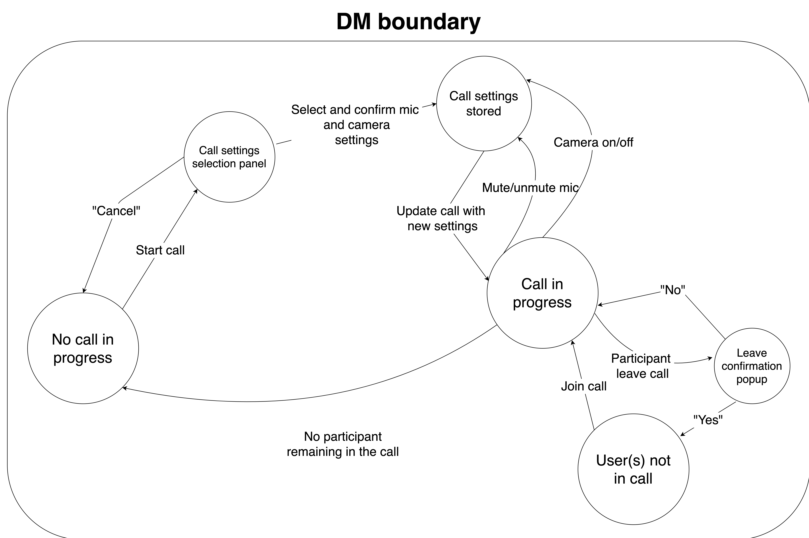

# **SDLC Planning - Wed17Grape**
## **[Requirements] Elicitation**
Two target users were interviewed: Peter Zhu (peterzhu122@gmail.com), a Discord user, and Bailey Vash (baileyvash@protonmail.com), a Microsoft Teams user. Full interview transcripts can be found in ```/sdlc_files/```.

The first user's primary use for Discord is to talk to friends during video gaming sessions, so he expressed concern over not being able to communicate via real-time audio on Flockr. He also expressed the difference between Discord and Flockr in channel management - where Discord have servers which contain channels, Flockr only has channels and no way of adding additional channels *within* channels. After briefly trialling Flockr, the user continued to express concern over the lack of direct messaging and file sharing in Flockr, which are critical aspects to his current use of Discord. The user expressed interest in the addition of "friends list" feature and the ability to block users, and towards the end questioned the current permissions management system in Flockr.

The second user's primarily uses Microsoft Teams for collaboration in an academic environment, including having lectures and tutorials via real-time video conferencing, and communication via text- and audio-based media when working in team-based projects. After briefly trialling Flockr, he expressed concern over the lack of real-time video and audio conferencing and file sharing, both of which he deemed critical for his use of team-based communication apps like Flockr. In addition, he ranked addition of direct messaging 8/10 in priority, addition of a "friends list" and blocking users 3/10 in priority, being able to display the active statuses of other users 7/10, and being able to display the statuses of sent messages 6/10.

<div style="page-break-after: always"></div>

## **[Requirements] Analysis - General**
After analysing the elicited information and balancing out user needs, we generated the following roadmap in problem-solution pairs: 

**Problem 1**: Some advanced users may want to group channels with similar purposes together
* ***Analysis:*** A user coming from Discord suggested the use of Discord-like servers to group channels, such that each “server” is considered a single channel and within are subchannels (Interview 1). However, implementing a Discord-like solution may impact the workflow of current Flockr users and users of more productivity-focused communication apps.
* ***Solution:*** As a middle ground between adding more features and keeping it simple, we have decided to add the optional ability to group channels like files in a folder - users can keep on using their channels as is, or group some of them together in what would be known as a ‘channel group”. 

**Problem 2**: Messaging is currently quite primitive in Flockr. The only way to message other users is in channels. What if the user wants to send a private message to another member? Having a private channel with the two users as the only members is a workaround, but other users can still be invited, so not completely private. Furthermore, most apps with messaging capabilities allow the user to see the status of a message after it has been sent (sent, delivered, seen, etc.), but Flockr doesn’t allow that.
* ***Solution:*** Add private direct messaging between two users. Add ability to show status of messages (sent, delivered, seen, etc.). 

**Problem 3:** Many team-based collaboration requires sending files, whether it be images, PDFs, word documents, or code. Flockr does not allow any form of file sharing.
* ***Solution 3:*** Add ability to send and receive files in channels.

**Problem 4:** The only form of communication in Flockr right now is via text-based messaging. Many teams require more than just text-based communication for Flockr to replace face-to-face collaboration.
* ***Solution 4:*** Add audio and video conferencing abilities.

These problem-solution pairs are expressed as user stories below, with each pair corresponding to an epic.

<div style="page-break-after: always"></div>

## **[Requirements] Analysis - user stories**

### **Epic 1:** Grouping channels 
#### **User story 1.1** 
As a user of Flockr who uses multiple channels for a similar purpose, I want to be able to group those channels together so that my channels list appears more organised.
#### *Task 1.1*
Create new grouping system for channels acting as folders to files.
#### *UAC 1.1 - rule-based*
* Can create channel groups
* Can delete channel groups
* Can move existing channels inside channel groups
* Can move existing channels out of channel groups
* Can create new channels inside channel groups
* A group are only visible to the user who created it

#### **User story 1.2** 
As a user of channel groups, I want to name the groups myself so that I can better organise channels by naming their categories (ex: Work, School, Friends, etc.).
#### *Task 1.2*
Add ability for channel group names to be user-defined.
#### *UAC 1.2 - rule-based* 
* Channel groups have names
* Creator channel groups can set its name

<div style="page-break-after: always"></div>

### **Epic 2:** Advanced messaging features 
#### **User story 2.1** 
As a user of Flockr, I want the ability to send direct messages so that I can privately message another user instead of putting the message in channels.
#### *Task 2.1*
Add the ability to send other users direct messages independent of channels.
#### *UAC 2.1 - rule-based*
* User can select the option to send a direct message
* User can choose which user to start a direct message conversation with
* User can send messages directly to the other user in the direct message chat without using channels
* Direct message chats are only visible to its two participants
* New participants cannot be invited to or join an existing direct message chat

#### **User story 2.2**
As a user of Flockr, I want to be able to see the status of a message after it has been sent so that I know when the other user(s) have received and/or seen it.
#### *Task 2.2* 
Add the ability to see the status of a message after it has been sent. Four statuses specifically: failed to send, sent, delivered/received, seen.
#### *UAC 2.2 - scenario-based*
* **Scenario:** Showing status of a message after it has been sent  
* **Given:** The user is in a channel or direct message  
* **When:** User sends a message channel or direct messages  
* **Then:** Flockr detects and displays the current status of the message (failed to send, sent, delivered, seen).

<div style="page-break-after: always"></div>

### **Epic 3:** File sharing in channels and direct messages 
#### **User story 3.1** 
As a user of Flockr, I want to be able to share files in channels and direct messages so I can collaborate better with my team and eliminate the need to email files to other users.
#### *Task 3.1* 
Add the ability for users to send and receive files in channels and direct messages.
#### *UAC 3.1 - rule-based* 
* Users can send local files into a channel or direct message
* Any user that is a part of the channel or direct message can download and retrieve sent files
* All file types are supported

#### **User story 3.2 - added in response to user comments during validation** 
As a user of file sharing, I want to be able to see and download files I have shared in the past as part of the message history so I don't have to keep resending the same files.
#### *Task 3.2* 
Add some form of indefinite file retention/storage to Flockr.
#### *UAC 3.2 - rule-based*
* Any file that are shared in a channel or direct message remains available for any user to retrieve/download indefinitely
* Past shared files appear in reverse chronological order as part of the message history as if it were a message

#### **User story 3.3 - added in response to user comments during validation**
As a user of file sharing, I sometimes want to be able to have files I've shared expire after a certain period of time so that I have more control over the files I've shared.
#### *Task 3.3*
Add ability to for a user set a time after which a file shared by the user in a channel or direct message expires and is no longer available to retrieve by any participant.
#### *UAC 3.3 - rule-based*
* Users can choose to have file shared expire and no longer available to download
* Users can set the period of time after which the files expire

<div style="page-break-after: always"></div>

### **Epic 4:** Real-time audiovisual communication
#### **User story 4.1**
As a user of Flockr, I want to be able to host video calls in Flockr to replace conventional collaboration methods such as face-to-face meetings.
#### *Task 4.1* 
Add ability to have real-time video calls between multiple users in channels or between two users in direct messages.
#### *UAC 4.1 - rule-based*
* Can make real-time video calls in direct messages (between two users) and in channels (between two or more users)
* Video calls are able to stream camera (video) and microphone (voice) inputs
* Hosts can end the video call at any time
* Any participant can leave a video call at any time
* If the host leaves the video call the video call is ended
* There is no host in direct message video calls

#### **User story 4.2**
As a user of Flockr, I want to be able to have audio-only calls for informal meetings or gaming sessions with friends where there is no need to appear in front of a camera.
#### *Task 4.2*
Add option to turn off/on the camera in video calls.
#### *UAC 4.2 - rule-based*
* Users can turn off and on their camera stream at any time during a video call 
* Users can continue to participate in the call voice-only after turning off their camera

#### **User story 4.3**
As a participant of a video call, I want to be able to mute my mic at any time during the call in case if a family member is talking to me and I don't want other participants of the call to hear my conversation.
#### *Task 4.3*
Add the option to turn off/on the microphone in video calls
#### *UAC 4.3* ###
* Users can turn off and on their microphone input at any time during a video call
* Users can hold a dedicated key to temporarily unmute their microphone when it is in a muted (off) state

#### **User story 4.4** ###
As a user of Flockr, I want to be able to mute my mic and turn off my camera before joining a meeting to avoid causing any disruption.
#### *Task 4.4* ###
Add panel to check and set audio and video settings after clicking on 'join call' button, but prior to actually joining the call.
#### *UAC 4.4 - scenario based* ###
* **Scenario:** Set up video call settings before joining a video call
* **Given:** The user is in a channel or direct message
* **When:** The user has selected to start or join a video call
* **Then:** Flockr displays a screen where users can set video and audio settings for the voice call, including the option to join with the camera off and mic muted
* **When:** The user selects and confirms settings
* **Then:** Flockr connects the user to the video call

#### **User story 4.5** ###
As the host of a video call in Flockr, I want to have the option to record the calls as video or audio files so that any non-participants have access to information shared during the meeting.
#### *Task 4.5* ###
Add the option to record video calls as video or audio files, but only to the host of each meeting or a Flockr owner.
#### UAC 4.5 - scenario-based ###
* **Scenario:** Host records a video call as a video or audio file
* **Given:** A video call has been started and the user is the host of the call (started the call or has been given host status)
* **When:** The user (host) selects the option to record the call
* **And:** Chooses whether to record as a video file or voice-only as an audio file
* **Then:** Flockr begins to record the video call
* **When:** The host ends the recording or the video call itself
* **Then:** Flockr saves the recording as a file on the user's local machine

#### **User story 4.6** ###
As a participant of a video call, I want the option to share my screen to other participants so that they can all see the same thing I am referring to, just like in a face-to-face meeting.
#### *Task 4.6* ###
Add the option for screen-sharing by any participant during a video call.
#### *UAC 4.6 - scenario-based* ###
* **Scenario:** Screen-sharing during video calls
* **Given:** The user is a participant of the video call and no other participant is sharing their screen
* **When:** The user selects the option to screen-share
* **Then:** Flockr displays the user's screen as the main video object of the call.
* **When:** The user selects the option to stop sharing his/her screen
* **Then:** Flockr stops displaying the user's screen as the main video object

#### **User story 4.7** ###
As the host of a video call, I want to be able to manage participants so that I can mute or remove any participant, to combat any trolling behaviour that often plagues the world of online conferencing.
#### *Task 4.7* ###
Give the host of video calls the ability to mute or remove any participant.
#### *UAC 4.7 - rule-based* ###
* The host of a video call can remove any participant at any time during the video call
* The host can mute the audio input of any participant
* The host can unmute the audio input of any participant

#### **User story 4.8** ###
As the host of a video call, I want to be able to transfer host privileges to any participant, in the case where I have started the video call but is not supposed to act as the host of the meeting.
#### *Task 4.8* ###
Add the ability for the host of video calls to transfer host status to any other participant. 
#### *UAC 4.8 - rule-based* ###
* The host of a video call can transfer host status to any other participant in the video call
* After host status is transferred to the other user, host status is removed from the current user
* There is only one host in each video call
* Any participant can request host status from the host. The host can either accept or reject the request

<div style="page-break-after: always"></div>

## **[Requirements] Analysis - use cases**
### **Use case 1 - Video calling**
For this report, we decided to generate a steps-based use case for video calling in Flockr (Epic 4).

**Use case:** Host and record a video call in a Flockr channel

**Goal in context:** For Flockr to more effectively replace face-to-face collaboration, users need to be able to have real-time multi-user video conferences. 

**Scope:** Flockr backend & frontend

**Level:** Primary Task

**Preconditions:** User needs to be registered and logged into Flockr. User needs to be part of a channel.

**Success end condition:** User is back in the channel after hosting video call with other users, exchanging information via real-time video, and then ending the video call after the meeting. A recording 

**Failed end conditions (any of the following):** 
* User is unable to host a video call continuously.
* User is unable to exchange the planned amount of information via real-time video due to a Flock error.
* User is unable to end the video call upon clicking the 'End call' button.
* A one-to-one recording is not saved to the user's local machine after either the recording or video call is ended.

**Primary actor:** The user, who is to host the video call.

**Trigger:** The user clicks on "Start video call".

#### **Steps taken** 
*MAIN SUCCESS SCENARIO*  
* **Step 1.** Flockr shows a 'Call settings' screen for user to confirm audio and video settings.  
* **Step 2.** User confirms settings selection, leaving both microphone and camera enabled.  
* **Step 3.** Flockr starts the video call for the user and shows a prompt in the channel that a video call is in progress.  
* **Step 4.** Other users in the channel join the video call via the prompt.  
* **Step 5.** As with the first user, Flockr asks each joining user to confirm their call settings before actually joining the call.  
* **Step 6.** Once all intended participants have joined, user selects "Start recording".  
* **Step 7.** Flockr asks user whether to record the call as a video or audio file.  
* **Step 8.** User selects record as a video.  
* **Step 9.** Flockr begins recording the video call in the background.  
* **Step 10.** User selects "Share screen".  
* **Step 11.** Flockr asks the user whether to share the entire screen or a single application window.
* **Step 12.** User selects option to share entire screen.
* **Step 13.** Flockr streams user's screen to the video call and makes it the primary video object
* **Step 14.** Flockr continues the video call without issue.
* **Step 15.** User clicks "End call" button.
* **Step 16.** Flockr ends the video call for every participant (given user is host), and returns to the channel interface.
* **Step 17.** Flockr saves a video recording of the call as a file on the user's local machine (as per user's request in steps 6-8).

### **Use case 2 - file sharing** ###
For file sharing, we decided to generate a use case diagram.


<div style="page-break-after: always"></div>

## **[Requirements] Validation**
We presented our user stories and use cases to the two people we reached out, and received the following comments back:
### **Peter Zhu (Interviewee 1)** - verbal (transcribed)
> They seem to be pretty good. I see that you added file sharing and direct messaging and they seem to work just as I'm used to. You also added direct messaging and a bunch of other messaging related stuff as well and it brings it closer to the other popular mainstream apps. So yeah it pretty much solves my previous gripes with your app and I reckon it is pretty close to being able to replace Discord for me. Yeah and file sharing is good for sharing memes and stuff with friends.  
</br>The video call use case looks to be useful enough to me. Like it is still different to what I'm used to in Discord, but I guess I can disable the camera to have voice calls when I'm gaming.  
</br>The channel grouping thing is kinda different to what Discord servers do, but I guess it is still useful to me. I actually like the fact that your app is taking a simpler approach and you told me as well that it is more for productivity stuff than what Discord is used for.

### **Bailey Vash (Interviewee 2)** - written
>I have found your video calling use case and user stories to be highly useful and suit my needs perfectly, especially when you have also taken into account the higher-level video calling features like camera and microphone control, screen sharing, and host privileges. It seems to reflect my experience in Microsoft Teams well, and it resolves my previous problems with Flockr to a large extent.  
</br>I also saw that Epic 2 and its user stories cover my previous concern with the lack of direct messaging, and your user acceptance criteria seem to cover my needs well.  
<br>I recall previously that I also found the file sharing a problem previously unsolved by Flockr, and I feel that your use case diagram for file sharing mostly reflects the standard approach taken by other mainstream apps including Teams. However, I do feel that the 30-day link expiry period is a bit restrictive, and I believe many users would want to either have their shared files stored in the channel indefinitely, or, if it were to expire, choose the expiry period themselves.

Upon receiving validation from both users, we decided specifically to modify our file sharing use case to accommodate for indefinite storage of files, and the ability for a user to set a custom expiry date if wished, based on Bailey Vash's comments. These are expressed as user stories 3.2 and 3.3. The use case would now look like this:


Afterwards we presented our modified file sharing use case and the added user stories 3.2 and 3.3 to Bailey Vash, who approved of these specification changes.

<div style="page-break-after: always"></div>

## **[Design] Interface Design**
Here, the above user stories and use cases are expressed as HTTP endpoint specifications. 
|Function name|HTTP Method|Parameters|Return type|Exceptions|Description|
|-------------|-----------|----------|-----------|----------|-----------|
|call/start|POST|```{token, channel_id, is_cam_on, is_mic_on}```|```{call_id}```|**InputError** when any of: <br><ul><li> ```channel_id``` does not refer to a valid channel</ul> **AccessError** when any of: <br><ul><li> The authorised user is not joined the channel|Start a video call from authorised user in the channel specified by ```channel_id```. The authorised user becomes host of the call.|
|call/startdirect|POST|```{token, dm_id, is_cam_on, is_mic_on}```|```{call_id}```|**InputError** when any of: <br><ul><li> ```dm_id``` does not refer to a direct message chat</ul> **AccessError** when any of: <br><ul><li> The authorised user is not a participant in the direcgt message chat|Start a video call from authorised user in the direct message chat specified by ```dm_id```. There is no host in a direct message call.|
|call/end|DELETE|```{token, call_id}```|```{}```|**InputError** when any of: <br><ul><li> ```call_id``` refers to a call that doesn't exist</ul> **AccessError** when NONE of the following is true: <br><ul><li>  The user is the host of the video call <li> The call is in a direct message chat <li> The authorised user is a Flockr or channel owner|Given an existing video call by ```call_id```, end the call.|
|call/join|PUT|```{token, call_id, is_cam_on, is_mic_on}```|```{}```|**InputError** when any of: <br><ul><li>```call_id``` refers to a call that does not exist</ul> **AccessError**  when any of: <br><ul><li> The authorised user is not part of the channel or direct message chat where the call is being held|Given an existing video call by ```call_id```, add the authorised user as a participant to the call.|
|call/leave|PUT|```{token, call_id}```|```{}```|**InputError** when any of: <br><ul><li>```call_id``` refers to a call that does not exist</ul> **AccessError** when any of: <br><ul><li> The authorised user is not a participant in the call|Given an existing video call by ```call_id``` and an authorised user currently in the call, remove the user from call.|
|call/mic|PUT|```{token, call_id, is_mic_on}```|```{}```|**InputError** when any of: <br><ul><li>```call_id``` refers to a call that does not exist</ul> **AccessError** when any of: <br><ul><li> The authorised user is not a participant in the call|Given an existing video call by ```call_id``` and an authorised user currently in the call, change the user's microphone settings as per ```is_mic_on```.|
|call/camera|PUT|```{token, call_id, is_cam_on}```|```{}```|**InputError** when any of: <br><ul><li>```call_id``` refers to a call that does not exist</ul> **AccessError** when any of: <br><ul><li> The authorised user is not a participant in the call|Given an existing video call by ```call_id``` and an authorised user currently in the call, change the user's camera settings as per ```is_cam_on```.|
|call/startshare|POST|```{token, call_id}```|```{}```|**InputError** when any of: <br><ul><li>```call_id``` refers to a call that does not exist <li> A screenshare is already in progress in the call</ul> **AccessError** when any of: <br><ul><li> The authorised user is not a participant in the call|Given an existing video call by ```call_id``` and an authorised user currently in the call, start sharing the user's screen.|
|call/endshare|DELETE|```{token, call_id}```|```{}```|**InputError** when any of: <br><ul><li>```call_id``` refers to a call that does not exist <li> A screenshare is not in progress in the call</ul> **AccessError** when any of: <br><ul><li> The authorised user is not the user who is screensharing|Given an existing video call by ```call_id``` and an authorised user currently sharing their screen, stop sharing the user's screen.|
|call/startrecord|PUT|```{token, call_id, is_video}```|```{}```|**InputError** when any of: <br><ul><li>```call_id``` refers to a call that does not exist <li> The ```call_id``` refers to a direct message call <li> A recording has already started</ul> **AccessError** when any of: <br><ul><li> The authorised user is not the host of the video call.|Given an existing video call by ```call_id``` and an authorised user that is the host of the call, start recording the video call in the background, recording audio-only if ```is_video``` is ```False```.|
|call/endrecord|PUT|```{token, call_id}```|```{}```|**InputError** when any of: <br><ul><li>```call_id``` refers to a call that does not exist <li> A recording is not currently in progress</ul> **AccessError** when any of: <br><ul><li> The authorised user is not the host of the video call.|Given an existing video call with a recording session active by ```call_id``` and an authorised user that is the host of the call, end the recording and save it as an audio or video file (depending on recording settings) on the user's local machine.|
|call/active|GET|```{token, channel_id}```|```{is_active}```|**InputError** when any of: <br><ul><li> ```channel_id``` does not refer to an existing channel|For a given channel, return whether a video call is active in it.|
|call/activedirect|GET|```{token, dm_id}```|```{is_active}```|**InputError** when any of: <br><ul><li> ```dm_id``` does not refer to an existing direct messsage chat|For a given direct message chat, return whether a video call is active in it.|
|call/adminmute|PUT|```{token, call_id, u_id}```|```{}```|**InputError** when any of: <br><ul><li>```call_id``` refers to a call that does not exist <li> ```u_id``` does not refer to a participant in the call</ul> **AccessError** when any of: <br><ul><li> The authorised user is not the host of the video call|Given an existing video call by ```call_id``` and an authorised user who is the host of the call, mute the microphone stream of the participant given by ```u_id```. Note that this overrides the user's own mic settings.|
|call/adminunmute|PUT|```{token, call_id, u_id}```|```{}```|**InputError** when any of: <br><ul><li>```call_id``` refers to a call that does not exist <li> ```u_id``` does not refer to a participant in the call</ul> **AccessError** when any of: <br><ul><li> The authorised user is not the host of the video call|Given an existing video call by ```call_id``` and an authorised user who is the host of the call, remove any admin mute placed on the microphone stream of the participant given by ```u_id```.|
|call/adminkick|PUT|```{token, call_id, u_id}```|```{}```|**InputError** when any of: <br><ul><li>```call_id``` refers to a call that does not exist <li> ```u_id``` does not refer to a participant in the call</ul> **AccessError** when any of: <br><ul><li> The authorised user is not the host of the video call|Given an existing video call by ```call_id``` and an authorised user who is the host of the call, remove the participant given by ```u_id``` from the call and prevent rejoining attempts for 30 minutes.|
|call/admintransfer|PUT|```{token, call_id, u_id}```|```{}```|**InputError** when any of: <br><ul><li>```call_id``` refers to a call that does not exist <li> ```u_id``` does not refer to a participant in the call</ul> **AccessError** when any of: <br><ul><li> The authorised user is not the host of the video call|Given an existing video call by ```call_id``` and an authorised user who is the host of the call, transfer host privileges to the participant marked by ```u_id```. Make sure host privileges are removed from user who successfully made the request.|
|channels/ groupcreate|POST|```{token, name}```|```{group_id}```|**InputError** when any of: </br> <ul><li> Name is more than 20 characters long|Creates a new channel group with that name.|
|channel/ groupaddchannel|PUT|```{token, group_id, channel_id}```|```{}```|**InputError** when any of: </br> <ul><li> Group does not exist</li><li> Channel with channel_id does not exist</ul> **AccessError** when any of: </br> <ul><li> User is not the creator of the group|Given a channel by its ```channel_id```, adds it to the channel group with ```group_id```.|
|direct/create|POST|```{token, u_id}```|```{dm_id}```|**InputError** when any of: </br> <ul><li> ```u_id``` does not refer to a valid user</li><li>```u_id``` refers to self (```token```)</li><li> A direct message chat already exists with that user|Given a user specified by ```u_id```, creates a direct message chat with the user.|
|direct/send|POST|```{token, dm_id, message}```|```{message_id}```|**InputError** when any of: </br><ul><li> Message is more than 1000 characters </li><li>```dm_id``` does not refer to a valid direct message chat</ul> **AccessError** when any of: <ul><li> The authorised user is not part of the direct message chat|Send a message from authorised to the direct message chat specified by ```dm_id```|
|direct/sendlater|POST|```{token, dm_id, message, time_sent}```|```{message_id}```|**InputError** when any of: <br><ul><li> Message is more than 1000 characters<li>```dm_id``` does not refer to a valid direct message chat<li>```time_sent``` is a time in the past</ul>**AccessError** when any of: <ul><li> The authorised user is not part of the direct message chat|Send a message from authorised user to the direct message chat specified by ```dm_id``` automatically at a time specified by ```time_sent```|
|file/send|POST|```{token, channel_id, path}```|```{file_id}```|**InputError** when any of:<br><ul><li> ```channel_id``` does not refer to a valid channel <li> ```path``` does not refer to a valid file <li> File is larger than 100 MB</ul> **AccessError** when any of: <br><ul><li> The authorised user has not joined the channel they are trying to send the file to|Send a file with file path given by ```path``` from authorised user to the channel specified by channel_id|
|file/senddirect|POST|```{token, dm_id, path}```|```{file_id}```|**InputError** when any of:<br><ul><li> ```dm_id``` does not refer to a valid direct message chat <li> ```path``` does not refer to a valid file <li> File is larger than 100 MB</ul>**AccessError** when any of: <ul><li> The authorised user is not part of the direct message chat|Send a file with file path given by ```path``` from authorised user to the direct message chat specified by dm_id|
|file/remove|DELETE|```{token, file_id}```|```{}```|**InputError** when any of: <br><ul><li> File given by ```file_id``` does not exist</ul> **AccessError** when NONE of the following is true: <br><ul><li> File was sent by the authorised user making this request <li> The authorised user is a Flockr or channel owner| Given a file by ```file_id```, the file is removed from the channel or direct message chat|
|file/expire|DELETE|```{token, file_id, expiry_time}```|```{}```|**InputError** when any of: <br><ul><li> File given by ```file_id``` does not exist <li>```expiry_time``` is a time in the past</ul> **AccessError** when NONE of the following is true: <br><ul><li> File was sent by the authorised user making this request <li> The authorised user is a Flockr or channel owner|Given a file by ```file_id```, the file is removed from the channel or direct message chat automatically at a time specified by ```expiry_time```|
|message/status|GET|```{token, message_id}```|```{is_sent, is_delivered, is_seen}```|**InputError** when any of: <br><ul><li> Message (based on ID) does not exist| Given a message by ```message_id```, check and return its status. Status is made up of three parts: <br><ul><li> whether it is sent by the current user to the channel/direct (```is_sent```),<li>whether it is received all logged-in users in the channel/direct (```is_delivered```), and <li>whether it is seen by all users in the channel/direct (```is_seen```).|

<div style="page-break-after: always"></div>

## [Design] Conceptual Modelling (State)
We decided to create state diagrams to model Flockr video calling as it is the most complex addition out of the planned features.
Below represents the state transitions during a video call in a channel.


Below represents the state transitions during a video call in a direct message chat (a planned feature specified in User Story 2.1).


Most notably, video calls in direct messages are missing admin/host-related features, including call recording. These are deliberate since having someone as a *host* in a two-person video call seems redundant.